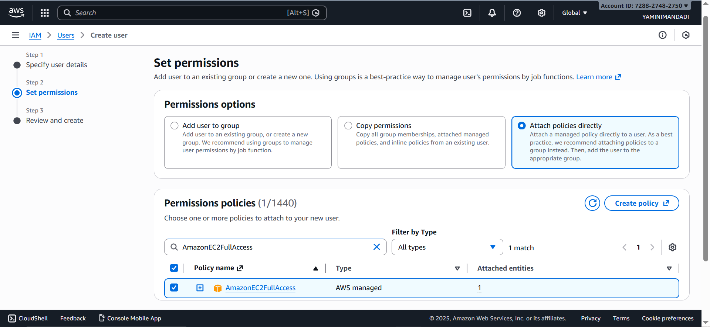
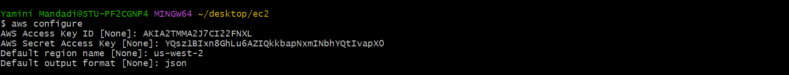
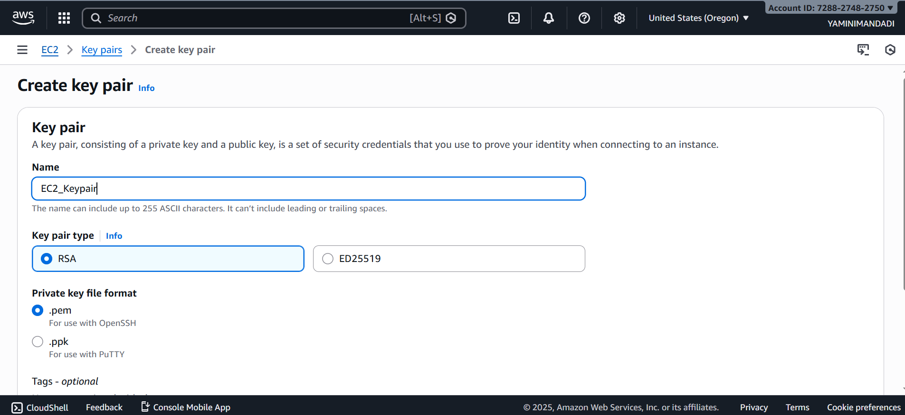
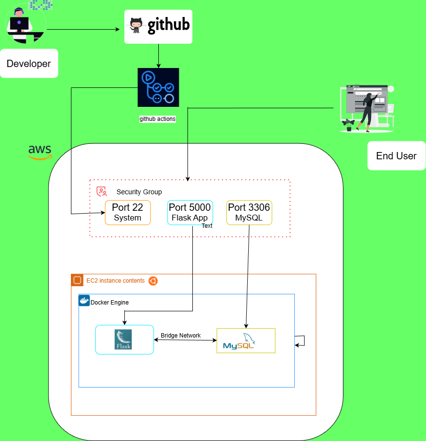

# DevOps Project Report: Automated CI/CD Pipeline for a 2-Tier Flask Application on AWS

**Author:** Yamini Mandadi
**Date:** December 27, 2025

---

### **Table of Contents**
1. [Project Overview](#1-project-overview)
2. [Architecture Diagram](#2-architecture-diagram)
3. [Step 1: AWS EC2 Instance Preparation](#3-step-1-aws-ec2-instance-preparation)
4. [Step 2: Install Dependencies on EC2](#4-step-2-install-dependencies-on-ec2)
5. [Step 3: Jenkins Installation and Setup](#5-step-3-jenkins-installation-and-setup)
6. [Step 4: GitHub Repository Configuration](#6-step-4-github-repository-configuration)
    * [Dockerfile](#dockerfile)
    * [docker-compose.yml](#docker-composeyml)
    * [Jenkinsfile](#jenkinsfile)
7. [Step 5: Jenkins Pipeline Creation and Execution](#7-step-5-jenkins-pipeline-creation-and-execution)
8. [Conclusion](#8-conclusion)
9. [Infrastructure Diagram](#9-infrastructure-diagram)
10. [Work flow Diagram](#10-work-flow-diagram)

---

### **1. Project Overview**
This document outlines the step-by-step process for deploying a two-tier web application (Flask and MySQL) on an AWS EC2 instance. The application is containerized using Docker and orchestrated with Docker Compose. A complete CI/CD pipeline is implemented using GitHub Actions, which automatically builds and deploys the application by securely connecting to the EC2 instance via SSH whenever new code is pushed to the GitHub repository.

---

### **2. Architecture Diagram**

```
+-----------------+      +----------------------+      +-----------------------------+
|   Developer     |----->|     GitHub Repo      |----->|       Github Workflow       |
| (pushes code)   |      | (Source Code Mgmt)   |      |         (SSH to EC2)        |
+-----------------+      +----------------------+      |                             |
                                                       | 1. Clones Repo              |
                                                       | 2. Builds Docker Image      |
                                                       | 3. Runs Docker Compose      |
                                                       +--------------+--------------+
                                                                      |
                                                                      | Deploys
                                                                      v
                                                       +-----------------------------+
                                                       |      Application Server     |
                                                       |      (Same AWS EC2)         |
                                                       |                             |
                                                       | +-------------------------+ |
                                                       | | Docker Container: Flask | |
                                                       | +-------------------------+ |
                                                       |              |              |
                                                       |              v              |
                                                       | +-------------------------+ |
                                                       | | Docker Container: MySQL | |
                                                       | +-------------------------+ |
                                                       +-----------------------------+
```

---

### **3. Step 1: AWS EC2 Instance Preparation**

1.  **Create User**
    * In the AWS console, Identity and Access Management --> Users --> Create User
    * Type terraform-User --> next.
    * Click on *Attach Policies directly*. Set permissions to *AmazonEC2FullAccess* and then create user.

    

    * Go to security credentials tab of user to create access key
    * Click on create access key and select Command Line Interface (CLI) option and create.
    * Open CLI, type **aws configure** and get credentials from AWS console.

    ```
        AWS Access Key ID:     <paste access key>
        AWS Secret Access Key: <paste secret key>
        Default region name:   us-west-2
        Default output format: json

    ```
     

2.  Create .pem file in AWS console as shown.

    

3.  Install Terraform through winget

    ```
        winget install HashiCorp.Terraform
        terraform -version

    ```
    Winget will download Terraform, installs it, add it to your PATH automatically.

4.  Create main.tf file and add the following.

    ```
    provider "aws" {
        region = "us-west-2"
    }

    resource "aws_security_group" "ec2_sg" {
        name        = "ec2-sg"
        description = "Security group for Flask and SSH"

        ingress {
            description = "SSH"
            from_port   = 22
            to_port     = 22
            protocol    = "tcp"
            cidr_blocks = ["0.0.0.0/0"] #or replace with your device IP address
        }

        ingress {
            description = "HTTP"
            from_port   = 80
            to_port     = 80
            protocol    = "tcp"
            cidr_blocks = ["0.0.0.0/0"]
        }

        ingress {
            description = "Flask App"
            from_port   = 5000
            to_port     = 5000
            protocol    = "tcp"
            cidr_blocks = ["0.0.0.0/0"]
        }

        egress {
            from_port   = 0
            to_port     = 0
            protocol    = "-1"
            cidr_blocks = ["0.0.0.0/0"]
        }

        tags = {
            Name = "EC2-SG"
        }
    }

    resource "aws_instance" "ec2" {
        ami                    = "ami-00f46ccd1cbfb363e" # ubuntu server (Oregon)
        instance_type          = "t2.micro"
        key_name               = "EC2_Keypair"         # .pem extension will be added auto
        vpc_security_group_ids = [aws_security_group.ec2_sg.id]

        tags = {
            Name = "Flask-EC2"
        }
    }

    ```
5.  Create EC2 with following commands in the CLI.

    ```
        terraform init
        terraform plan
        terraform apply

    ```


### **6. Step 4: GitHub Repository Configuration**

Ensure your GitHub repository contains the following files.

#### **Dockerfile**
This file defines the environment for the Flask application container.
```dockerfile
# Use an official Python runtime as a parent image
FROM python:3.9-slim

# Set the working directory in the container
WORKDIR /app

# Install system dependencies required for mysqlclient
RUN apt-get update && apt-get install -y gcc default-libmysqlclient-dev pkg-config && \
    rm -rf /var/lib/apt/lists/*

# Copy the requirements file to leverage Docker cache
COPY requirements.txt .

# Install Python dependencies
RUN pip install --no-cache-dir -r requirements.txt

# Copy the rest of the application code
COPY . .

# Expose the port the app runs on
EXPOSE 5000

# Command to run the application
CMD ["python", "app.py"]
```

#### **docker-compose.yml**
This file defines and orchestrates the multi-container application (Flask and MySQL).
```yaml
version: "3.8"

services:
  mysql:
    container_name: mysql
    image: mysql
    environment:
      MYSQL_DATABASE: "devops"
      MYSQL_ROOT_PASSWORD: "root"
    ports:
      - "3306:3306"
    volumes:
      - mysql-data:/var/lib/mysql
    networks:
      - two-tier
    restart: always
    healthcheck:
      test: ["CMD", "mysqladmin", "ping", "-h", "localhost", "-uroot", "-proot"]
      interval: 10s
      timeout: 5s
      retries: 5
      start_period: 60s

  flask:
    build:
      context: .
    container_name: two-tier-app
    ports:
      - "5000:5000"
    environment:
      - MYSQL_HOST=mysql
      - MYSQL_USER=root
      - MYSQL_PASSWORD=root
      - MYSQL_DB=devops
    networks:
      - two-tier
    depends_on:
      - mysql
    restart: always
    healthcheck:
      test: ["CMD-SHELL", "curl -f http://localhost:5000/health || exit 1"]
      interval: 10s
      timeout: 5s
      retries: 5
      start_period: 60s

volumes:
  mysql-data:

networks:
  two-tier:
```
### **8. Github configuration**

*   Go to Settings of your GitHub repository
*   Select Secrets and variables
*   Click Actions
*   Click New repository secret

```
    Secret Name	  Description
    EC2_HOST	  Public IPv4 address or public DNS of the EC2 instance
    EC2_USER	  SSH username (e.g. ubuntu)
    EC2_SSH_KEY	  SSH key (.pem) used to connect to EC2
```

*  Create the folder .github/workflows in repository root folder
*  Create a file named deploy-ssh.yml and the following code to it.

```yaml
name: Deploy (SSH -> EC2)

on:
  push:
    branches: ["main"]

jobs:
  deploy:
    runs-on: ubuntu-latest

    steps:
      - name: SSH and deploy with Docker Compose
        uses: appleboy/ssh-action@v1.0.3
        with:
          host: ${{ secrets.EC2_HOST }}
          username: ${{ secrets.EC2_USER }}
          key: ${{ secrets.EC2_SSH_KEY }}
          script: |
            set -e
            cd /home/${{ secrets.EC2_USER }}/Two-Tier-Flask-App-Project/Two-Tier-Flask-App-Project-with-Github-Actions

            git pull origin main
            docker compose down || true
            docker compose up -d --build
            docker compose ps

            # quick check
            sleep 5
            curl -f http://localhost:5000/health || curl -f http://localhost:5000/

```


6.  **Connect to EC2 Instance:**
    * Use SSH to connect to the instance's public IP address.
    ```bash
    ssh -i /path/to/key.pem ubuntu@<ec2-public-ip>
    ```

---

7. **Install Dependencies on EC2**

1.  **Update System Packages:**
    ```bash
    sudo apt update && sudo apt upgrade -y
    ```

2.  **Install Git, Docker, and Docker Compose:**
    ```bash
    sudo apt install git docker.io docker-compose-v2 -y
    ```

3.  **Start and Enable Docker:**
    ```bash
    sudo systemctl start docker
    sudo systemctl enable docker
    ```

4.  **Add User to Docker Group (to run docker without sudo):**
    ```bash
    sudo usermod -aG docker $USER
    newgrp docker
    ```

---

5.  Clone the repository to EC2.  
    mkdir -p ~/Two-Tier-Flask-App-Project
    cd ~/Two-Tier-Flask-App-Project
    git clone https://github.com/Yaminiiii7/Two-Tier-Flask-App-Project-with-Github-Actions.git .


---

### **8. Conclusion**
The CI/CD pipeline is now fully operational. Any `git push` to the `main` branch of the configured GitHub repository will automatically trigger the GitHub actions, which will SSH into EC2, build the new Docker image and deploy the updated application, ensuring a seamless and automated workflow from development to production.


### **9. Infrastructure Diagram**



### **10. Work flow Diagram**

